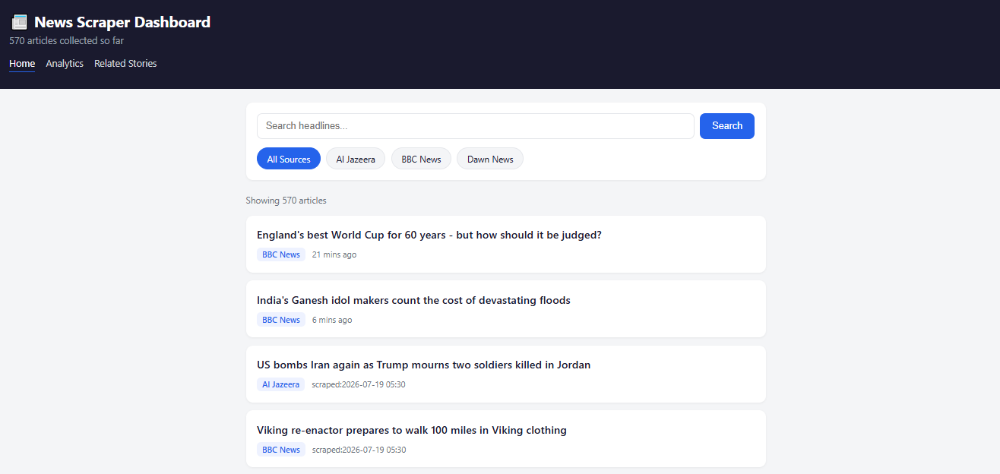
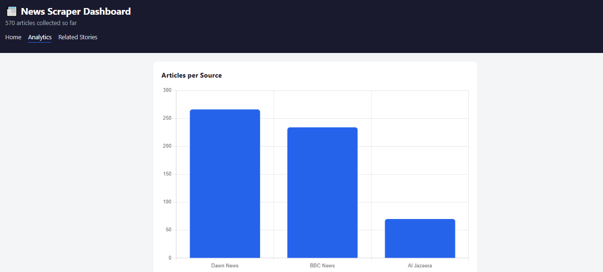
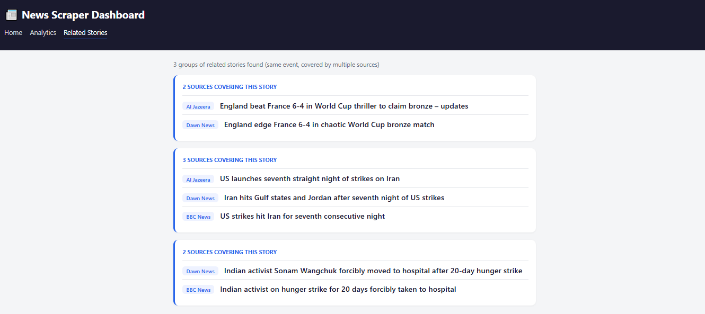

# 📰 News Scraper

A multi-source news scraper with a web dashboard, automated background scraping, keyword email alerts, analytics, and cross-source "related story" detection — built end-to-end with Python and Flask.


**🔴 [Live Demo](https://news-scraper-nkskzoyrgpysdrbg6fnt8c.streamlit.app)** — try it right now, no install needed.

---

## What it does

This project automatically scrapes headlines from multiple news sites, stores them in a database with deduplication, runs in the background on a schedule, and surfaces the data through a searchable web dashboard — with email alerts when a keyword you care about appears, and automatic detection of stories being covered by more than one source.

## Features

- 🔎 **Multi-source scraping** — BBC News, Dawn News, Al Jazeera, CNN, Geo News (easily extendable, see `sources.py`)
- 🗄️ **SQLite storage with deduplication** — never stores the same article twice
- ⏰ **Background automation** — runs on a schedule via Windows Task Scheduler / cron, no manual triggering needed
- 🖥️ **Web dashboard** — search, filter by source, browse everything collected
- 📊 **Analytics** — charts for articles per source and articles scraped per day
- 🔗 **Related story detection** — automatically groups articles from different sources that cover the same event
- 🔔 **Keyword email alerts** — get notified by email the moment a new article matches your watched keywords
- 📝 **Full logging** — every scheduled run is logged to `scraper.log` for easy debugging

## Screenshots

> Add your own screenshots to a `screenshots/` folder and update the paths below.

| Dashboard | Analytics | Related Stories |
|---|---|---|
|  |  |  |

## Tech Stack

- **Python 3** — core scraping and logic
- **Requests + BeautifulSoup** — HTML fetching and parsing
- **SQLite** — lightweight local database
- **Flask** — local web dashboard
- **Streamlit** — deployed cloud dashboard ([live demo](https://news-scraper-nkskzoyrgpysdrbg6fnt8c.streamlit.app))
- **Chart.js** — analytics charts (Flask version)
- **smtplib** — email alerts

## Project Structure

```
news_scraper/
├── scraper.py              # Main scraper — fetches & saves articles from all sources
├── sources.py               # Config: each news site's URL + CSS selectors
├── database.py               # All database read/write logic
├── duplicates.py              # Cross-source related-story detection
├── alerts.py                   # Keyword matching + email sending
├── alert_config.example.py      # Template for your email/keyword settings
├── dashboard.py                  # Flask web dashboard (local use)
├── streamlit_app.py               # Streamlit dashboard (used for cloud deployment)
├── templates/                     # Dashboard HTML pages
│   ├── dashboard.html
│   ├── analytics.html
│   └── related.html
├── run_scraper.bat                 # Used by Task Scheduler to run the scraper
├── view_articles.py                 # Quick CLI script to view stored articles
└── requirements.txt
```

## Setup

```bash
# 1. Clone the repo
git clone https://github.com/Hamid953-cloud/News-Scraper.git
cd News-Scraper

# 2. Create a virtual environment
python -m venv venv
venv\Scripts\activate        # Windows
# source venv/bin/activate   # Mac/Linux

# 3. Install dependencies
pip install -r requirements.txt

# 4. Set up email alerts (optional)
copy alert_config.example.py alert_config.py
# then edit alert_config.py with your Gmail address, App Password, and keywords
```

## Usage

**Run the scraper once:**
```bash
python scraper.py
```

**View collected articles in the terminal:**
```bash
python view_articles.py
```

**Launch the web dashboard:**
```bash
python dashboard.py
```
Opens automatically at `http://localhost:5000`.

**Automate it** (Windows): use Task Scheduler to run `run_scraper.bat` on a repeating schedule, so new articles are collected even when you're not at your computer.

## How selectors work (and how to fix them if a site changes)

Each source's scraping rules live in `sources.py` as CSS selectors. News sites redesign their HTML occasionally, which can break scraping for that source. If a source starts returning 0 articles:

1. Open the site in your browser, right-click a headline → **Inspect**
2. Note the `<a>` tag's class or attributes
3. Update the matching entry in `sources.py`

## Roadmap / Ideas for future versions

- [ ] Sentiment analysis on headlines
- [ ] CSV/Excel export from the dashboard
- [ ] Telegram bot alerts alongside email
- [ ] Daily digest email instead of per-run alerts
- [ ] Deploy to the cloud for 24/7 access from anywhere

## License

MIT — free to use, modify, and learn from.
